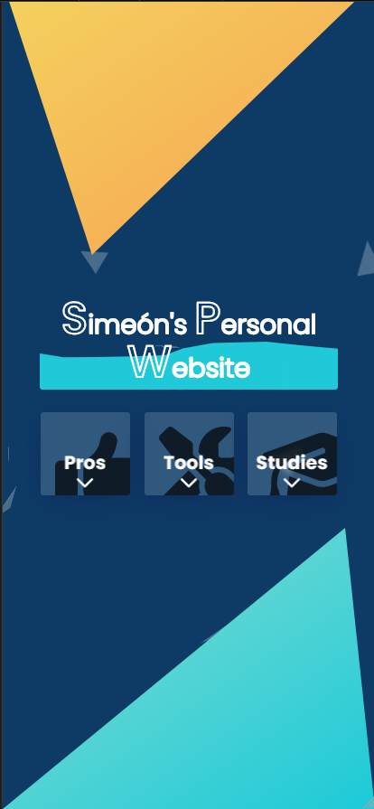

# Simeón's Personal Website
## palomarblumenthaljaimesimeon@gmail.com

In this document you will find some explanations for the performance analysis and design of this website, which I've created from scratch in my spare time.

## Performance Analysis

This analysis was made using Google's Web.dev tool, that uses the following metrics:

* **First Contentful Paint (FCP)**: Measures the time it takes to render the first visible element on screen.
  
* **Largest Contentful Paint (LCP)**: Measures the time it takes to render the largest visible element on screen.

* **Cumulative Layout Shift (CLS)**: Measures the visual stability of the webpage's content as a user views it.
  
* **Total Blocking Time (TBT)**: Measures the total time after First Contentful Paint (FCP) where the main thread was blocked for long enough to prevent responses to user input.
   
* **Speed Index (SI)**: Ranking factor that helps determine how well you are optimized for poor networks and lower data bandwidths.

### Desktop Version

The desktop version has recieved very good results in all metrics. But one I would like to discuss in this particular case is Large Contentful Paint (LCP).

The thing is that, when the page loads, the main header of the page has an interesting animation I made that lasts 3 seconds, and then the content cards below start appearing for another 3 seconds.

On the one hand, this animation presents the information of the page little by little and smoothly to the user and gives the the site a sense of motion. But on the other hand, it makes it so the largest element of the page takes a total of 6 seconds to render completely.

This results in a very poor score in the LCP metric. So I decided to maintain my artistic view of the design and keep the animation as it is, but disable it just for the analysis in order to see if there was another issue.

**The final score for the performance analysis when the animation is loaded is 72.**

### Mobile Version

The same thing happens with the mobile version of the website. When the starting animations are disabled, the  performance score sits at 95 points.

**But the final score for the performance analysis on mobile when the animation is enabled, is 76.**

## Design justifications

If I had to define the design of this website in three words, those would be “moving, yet clear”. My main issue with modern websites, compared to the ones that could be seen during the early days of the internet, is that, even though they are clear and easy to read and understand, that comes with the cost of lack of movement and originality in general. I wanted to find a balance between a clear and modern design, and an imaginative one, full of movement.

For it to have movement, I made custom animations for every major element. Starting with the background, I made an algorithm that generates a fixed number of “shards” or crystal triangles in random coordinates of the screen, that move in a random direction back and forth for a random duration, and spin randomly in the Z axis. Adding this random generator makes it so that the design changes every time you visit the page, making it a little bit special for every user.

On the other hand, regarding the main title, I decided to use a simple clip-path animation, combined with another animation that changes the colors going through the color palette of the website. In the different versions and states of the page, the animation refers to the filling of the letters of the title, or to its background. I’m not very good at designing logos, and I didn’t want to use an AI generator, because the attempts I made at generating one were pretty rough. So I went with a simple font and animations that fitted the rest of the design.

Finally, in order to make it a clear design, I used Font-Awesome icons to make the options of the menu easy to understand without having to read the headers, and dividing the information into the three main blocks visible: "What I'm good at", "The tools I know" and "My studies". Lastly, the design I used for the menu cards and the information section is called "glassmorphism".